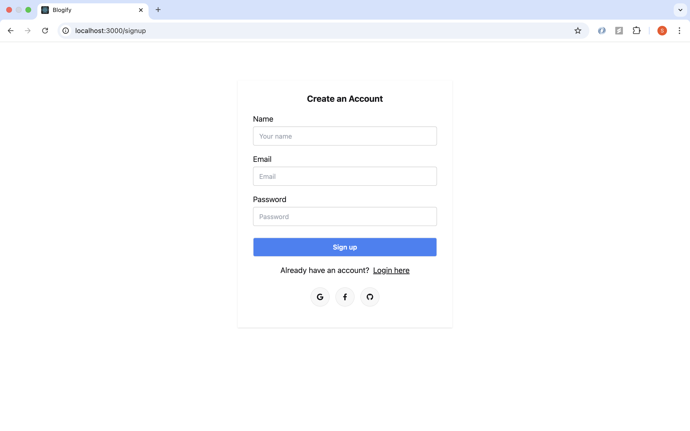
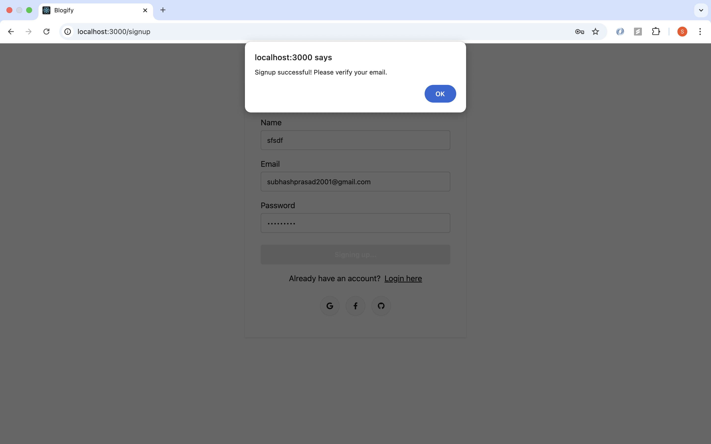
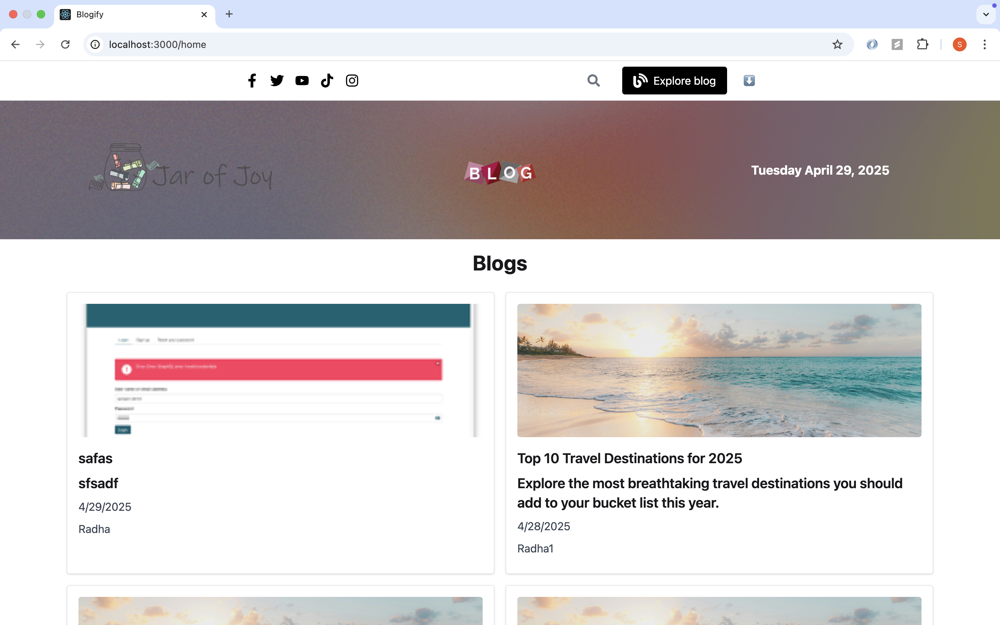
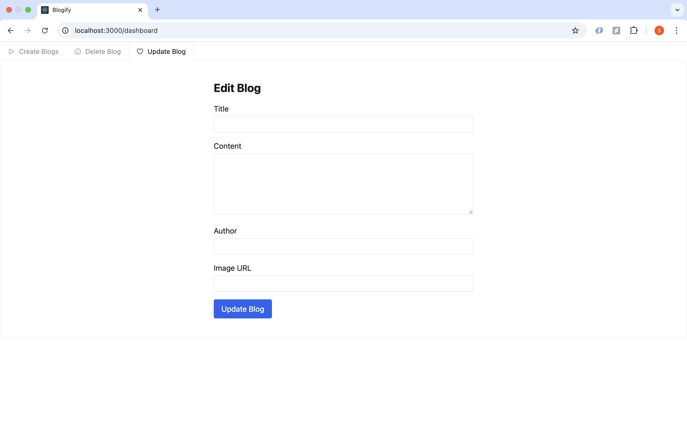

# Blog Management System

## 📌 Introduction

[](https://awesome.re)

This project is a full-stack blog management system where admins can view, edit, and delete blog posts. Built with React.js on the frontend and a Node.js + Express backend, the system ensures secure operations using JWT authentication.

It is designed to be simple, user-friendly, and efficient for managing content on a blog website. Admins can fetch all blogs, update blog details (title, content, image, author), or delete blogs directly from the dashboard.

## Features

🔒 JWT-based authentication for secure access

📋 Fetch and display all blogs in a clean table

✏️ Edit existing blog posts

🗑️ Delete blog posts with confirmation

🚀 Protected routes for authorized access only

✏️ Email Verifications

🖼️ Upload and edit blog images

🔄 Real-time UI updates after editing or deleting blogs

📦 Axios for smooth API calls

## 👨‍💻 Tech Stack Used

### Frontend

- ReactJS, TailwindCSS, Material UI, JavaScript, Axios, AuthContext, React-icons, SweetAlert2

### Backend

- Node.js, Express.js, JWT, MongoDB, Nodemailer

## Folder Structure

```bash
mern-stack-project/
├── backend/
│   ├── config/
│   │   └── db.js
│   ├── controllers/
│   │   ├── authController.js
│   │   ├── blogController.js
│   ├── models/
│   │   ├── user.js
│   │   └── blogPost.js
│   ├── routes/
│   │   ├── authRoutes.js
│   │   ├── blogRoutes.js
│   ├── middleware/
│   │   └── authMiddleware.js
│   │   └── roleMiddleware.js
│   ├── utils/
│   │   └── sendEmail.js
│   ├── .env
│   ├── server.js
│   └── package.json
├── frontend/
│   ├── public/
│   │   └── index.html
│   ├── src/
│   │   ├── components/
│   │   │   ├── banner.js
│   │   │   ├── blogItem.js
│   │   │   ├── Navbar.js
│   │   ├── pages/
│   │   │   ├── admin.js
│   │   │         └── blog.js
│   │   │                └── createBlog.js
│   │   │                └── layout.js
│   │   │                └── manageBlogs.js
│   │   │                └── updateBlog.js
│   │   │   └── blog.js
│   │   │   └── Main.js
│   │   │   └── SignIn.js
│   │   │   └── SignUp.js
│   │   ├── App.js
│   │   ├── index.js
│   │   ├── App.css
│   │   │
│   └── package.json
├── README.md
└── .gitignore

```

## API Endpoints

#### Authentication

POST /api/auth/signup - Register a new user.

```bash
{
  "name": "String",
  "email": "String",
  "password": "String"
  Email: Verification
}
```

POST /api/auth/login - Log in an existing User.

```bash
{
  "email": "String",
  "password": "String"
}
```

#### Create Blog

POST /api/blog - Create a new blog.

#### Get all blog

GET /api/blog

#### update Blog

PATCH /api/blog/:id

#### Delete Blog

DELETE /api/blog/:id

#### Verify Blog

/api/auth/verify/token

## 🛠️ Installation Steps

Star and Fork the Repo 🌟 and this will keep us motivated.

1. Clone the repository

```bash
git clone https://github.com/subhashdippu/Blogify.git
```

2. Change the working directory

```bash
cd Blogify
```

3. Install dependencies

```bash
npm install
```

4. Run the app

```bash
npm start
```
## 📸 Screenshots








